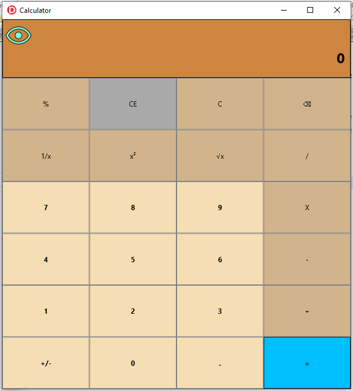
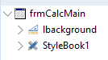
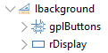
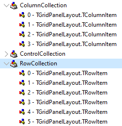
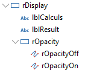
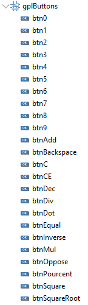
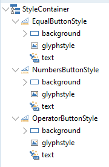

**Created in Delphi using RAD Studio 10.4.1**

# Windows 10 Calculator Clone - Delphi Instructions

## Setup
1. Open RAD Studio.  Click File->New->Multi-Device Application - Delphi and select "Blank Application".
2. Press Cntl+Shift+S to save all files.  Save the .pas file as *"fCalcMain"* and the project as *"Calculator"*.

## Visual Interface

You'll have this software after following the instructions. Of course you are free to choose the colors you prefer.



1. In the properties editor, on the Form1, change :
	1. "Name" => "frmCalcMain"
	2. "Caption" => "Calculator"

Use the structure panel to verify the components are at the good place.



On the main form:
1. add a TLayout and change its properties :
	1. "Name" => "lBackground"
	2. "Align" => "Client"
2. add a TStyleBook
3. set the "StyleBook" property from "frmCalcMain" to your style book name (ex: StyleBook1)



On the lBackground layout:
1. add a TRectangle and change its properties :
	1. "Name" => "rDisplay"
	2. "Fill.Color" => "Peru" or the color you wants for the top parts of the screen where equation and result will be displayed.
	3. "Align" => "Top"
	4. "Height" => 100
	4. "HitTest" => False
	5. "Padding" => 10 pixels for the 4 subproperties
2. add a TGridPanelLayout and change its properties :
	1. "Name" => "gplButtons"
	2. "Align" => "Client"
	3. Save the file (Ctrl+S)
	4. Press Alt+F12 to enter the source of the form
	5. Localize the "ColumnCollection" part under "gplButtons". Copy "item" bloc to have it 4 times and change their "Value" to "25.000000000000000000" (the number of 0 and indentation are important).
	6. Press Alt+F12, the grid must now have 4 columns.
	7. Save the file (Ctrl+S)
	8. Press Alt+F12 to enter the source of the form
	9. Localize the "RowCollection" part under "gplButtons". Copy "item" bloc to have it 6 times and change their "Value" to "16.666666666666660000" (the number of 0 and indentation are important).
	10. Press Alt+F12, the grid must now have 4 columns and 6 rows.
	11. Save the file (Ctrl+S)
	


You could use the "add element" in the popup menu directly from the structure panel, but the size must be changed in the form source directly.



On the rDisplay layout:
1. add a TLabel and change its properties :
	1. "Name" => "lblCalculs"
	2. "Align" => "Top"
	3. "TextSettings.HorzAlign" => "Trailing"
2. add a TLabel and change its properties :
	1. "Name" => "lblResult"
	2. "Align" => "Client"
	3. "Scale.X" and "Scale.Y" => 2
	4. "TextSettings.Font.Style" => check fsBold
	5. "TextSettings.HorzAlign" => "Trailing"
2. add a TRectangle and change its properties :
	1. "Name" => "rOpacity"
	2. "Fill.Kind" => "None"
	3. "HitTest" => True
	4. "Stroke.Fill" => "None"
	5. "Position" => 5 for "X" and "Y"
	5. "Size" => 44 for "Width" and "Height"
3. add a TPath to rOpacity rectangle
	1. "Name" => "rOpacityOff"
	2. "Align" => "client"
	3. "HitTest" => False
	4. "WrapMode" => "Fit"
	5. click on the ellipsis button of "Data" and copy "M2,5.27L3.28,4L20,20.72L18.73,22L15.65,18.92C14.5,19.3 13.28,19.5 12,19.5C7,19.5 2.73,16.39 1,12C1.69,10.24 2.79,8.69 4.19,7.46L2,5.27M12,9A3,3 0 0,1 15,12C15,12.35 14.94,12.69 14.83,13L11,9.17C11.31,9.06 11.65,9 12,9M12,4.5C17,4.5 21.27,7.61 23,12C22.18,14.08 20.79,15.88 19,17.19L17.58,15.76C18.94,14.82 20.06,13.54 20.82,12C19.17,8.64 15.76,6.5 12,6.5C10.91,6.5 9.84,6.68 8.84,7L7.3,5.47C8.74,4.85 10.33,4.5 12,4.5M3.18,12C4.83,15.36 8.24,17.5 12,17.5C12.69,17.5 13.37,17.43 14,17.29L11.72,15C10.29,14.85 9.15,13.71 9,12.28L5.6,8.87C4.61,9.72 3.78,10.78 3.18,12Z" in th dialog box to show the "eye-off-outline" from [](https://materialdesignicons.com/))
4. add a TPath to rOpacity rectangle
	1. "Name" => "rOpacityOn"
	2. "Align" => "client"
	3. "HitTest" => False
	4. "WrapMode" => "Fit"
	5. click on the ellipsis button of "Data" and copy "M12,9A3,3 0 0,1 15,12A3,3 0 0,1 12,15A3,3 0 0,1 9,12A3,3 0 0,1 12,9M12,4.5C17,4.5 21.27,7.61 23,12C21.27,16.39 17,19.5 12,19.5C7,19.5 2.73,16.39 1,12C2.73,7.61 7,4.5 12,4.5M3.18,12C4.83,15.36 8.24,17.5 12,17.5C15.76,17.5 19.17,15.36 20.82,12C19.17,8.64 15.76,6.5 12,6.5C8.24,6.5 4.83,8.64 3.18,12Z" in th dialog box to show the "eye-outline" from [](https://materialdesignicons.com/))



On the gplButtons layout:
1. add 24 TButtons and change their properties :
	1. "Name" => use the name you wants or look at the screen capture
	2. "Align" => "client"
	3. "CanFocus" => False
	3. "Text" => depending of the button, in this order : "%", "CE", "C", "back", "1/x", "x^2", "rac x", "/", "7", "8", "9", "X", "4", "5", "6", "-", "1", "2", "3", "+", "+/-", "0", ".", "="
	4. for the numbers, change their "Tag" property to 100+thenumber (100, 101, 102, 103, 104, 105, 106, 107, 108,109)

Save your file.

## The button's style



Double click on your StyleBook1 component. In the style editor, under Stylecontainer, we will create 3 new button's style.

1. add a TLayout
2. set "Align" to "Center"
3. set "StyleName" to "EqualButtonStyle" for the equal button, "OperatorButtonStyle" for operators and "NumbersButtonStyle" for digits
4. add a TRectangle under the TLayout
5. set "Align" to "Client"
6. set "StyleName" to "background"
7. set "Fill.Color" and "Stroke.Color" to the colors you wants depending of the button type
8. add a TColorAnimation under the TRectangle
9. set "PropertyName" to "Fill.Color"
10. set "Inverse" to True
11. set "StartValue" to the same color you used for TRectangle.Fill.Color
12. set "EndValue" to "DarkGray" or an other color you wants when the mouse is over the button
13. set "Trigger" to "IsMouseOver=true"
14. set "TriggerInverse" to "IsMouseOver=false"
15. add a TGlyph under the TLayout
16. set "Align" to "Left"
17. set "StyleName" to "glyphstyle"
18. set"Visible" to False
19. add a TButtonStyleTextObject under the TLayout
20. set "Align" to "Client"
21. set "StyleName" to "text"
22. set "TextSettings.Font.Style" to "fsBold" for "NumbersButtonStyle"

Close the style editor and save your file.

1. Select the "equal" button and change its "StyleLookup" property to "EqualButtonStyle" you must have in the list.
2. Select the operators buttons (one by one or with Shift key pressed for multiselect) and change their "StyleLookup" property to "OperatorButtonStyle" you must have in the list.
3. Select the numbers buttons (one by one or with Shift key pressed for multiselect) and change their "StyleLookup" property to "NumbersButtonStyle" you must have in the list.

Save your file.

You have the user interface. Let's code a little.

## The code

In this program I choosed to store each values in strings. In theory we are not stopped by numbers size, but we have to use real numbers to calculate and of course its depend on the number type you choose. In this case "[extended](http://docwiki.embarcadero.com/RADStudio/Sydney/en/Simple_Types_(Delphi)#Real_Types)".

go to the editor code for the fCalcMain.pas file.

### Needed units

In the Implementation section, after $R directive, add this code :

```
uses
  System.Character, System.Threading, FMX.Ani;
```

### Types

Add those two enumarated types before the frmCalcMain type declaration.

```
type
{$SCOPEDENUMS ON}
  TCalcOperator = (None, Ajouter { + } , Soustraire { - } , Multiplier { * } ,
    Diviser { / } , Equal { = } );
  TCalcDirectOperator = (Square { x^2 }, RootSquare { rac X }, Inverse { 1/x }, Percent { % });
{$SCOPEDENUMS OFF}
```

### Variables

In the "private" section of the "frmCalcMain" class, add those variables :

```
  private
    CurTotal: string; // current total
    CurTotalCalc: string; // actual operation
    CurPosNeg: string; // + or -
    PrevValue: string; // = curValue after Equal
    CurValue: string; // current value
    CurOperator: TCalcOperator;
	property AppOpacity: boolean;
```

In the "public" section of the frmCalcMain class, add this :

```
  public
    DecimalSeparator: Char;
```

### Methods

After the property in the private part of "frmCalcMain", add this code :

```
    procedure TapNumber(AValue: byte);
    procedure TapOperator(AOperator: TCalcOperator);
    procedure TapDirectOperator(AOperator: TCalcDirectOperator);
    procedure TapBackspace;
    procedure TapCE;
    procedure TapC;
    procedure TapDot;
    procedure TapPlusMinus;
    procedure InitCalculator;
    procedure ChangeDisplayedResult(AValue: string);
    procedure ChangeDisplayedCalcul(ACalcul: string);
    procedure CalcTotal(AValue: string; OpStringToAdd: string = '');
```

Press Shift+Ctrl+C to create the implementation code for this declarations. Save your file.

### Events

#### The form : frmCalcMain

In the properties editor, select "frmCalcMain" and go to its events.

For onCreate, copy this code :

```
  AppOpacity := false;
  DecimalSeparator := TFormatSettings.Create.DecimalSeparator;
  btnSquare.Text := 'x²';
  btnSquareRoot.Text := '√x';
  btnBackspace.Text := #$232B;
  InitCalculator;
```

For onKeyDown remplace the "begin" line by :

```
var
  btn: TButton;
  num: integer;
  ctrl: TFmxObject;
  i: integer;
begin
  btn := nil;
  if KeyChar.IsDigit then
  begin
    num := trunc(KeyChar.GetNumericValue);
    for i := 0 to gplButtons.Children.Count - 1 do
    begin
      ctrl := gplButtons.Children[i];
      if (ctrl is TButton) and ((ctrl as TButton).tag = num + 100) then
      begin
        btn := (ctrl as TButton);
        break;
      end;
    end;
    TapNumber(num);
  end
  else if (Key = vkBack) then
  begin
    btn := btnBackspace;
    TapBackspace;
  end
  else if (Key = vkReturn) or (KeyChar = '=') then
  begin
    btn := btnEqual;
    TapOperator(TCalcOperator.Equal);
  end
  else if (Key = vkDelete) then
  begin
    btn := btnCE;
    TapCE;
  end
  else
    case KeyChar of
      '+':
        begin
          btn := btnAdd;
          TapOperator(TCalcOperator.Ajouter);
        end;
      '-':
        begin
          btn := btnDec;
          TapOperator(TCalcOperator.Soustraire);
        end;
      '*':
        begin
          btn := btnMul;
          TapOperator(TCalcOperator.Multiplier);
        end;
      '/':
        begin
          btn := btnDiv;
          TapOperator(TCalcOperator.Diviser);
        end;
      '%':
        begin
          btn := btnPourcent;
          TapDirectOperator(TCalcDirectOperator.Percent);
        end;
      '.', ',':
        begin
          btn := btnDot;
          TapDot;
        end;
    end;
  if assigned(btn) then
  begin
    tanimator.AnimateFloat(btn, 'Opacity', 0.5, 0.1);
    tanimator.AnimateFloatDelay(btn, 'Opacity', 1, 0.1, 0.15);
  end;
```

In the structure panel select btn0 to btn9 and on the properties editor add the onClick event with this code :

```
  if (Sender is TButton) then
    TapNumber((Sender as TButton).Text.tointeger);
```

For the onClick on percent button, use this code :

```
  TapDirectOperator(TCalcDirectOperator.Percent);
```

For the onClick on CE button, use this code :

```
  TapCE;
```

For the onClick on C button, use this code :

```
  TapC;
```

For the onClick on backspace button, use this code :

```
  TapBackspace;
```

For the onClick on inverse (1/x) button, use this code :

```
  TapDirectOperator(TCalcDirectOperator.Inverse);
```

For the onClick on square (x^2) button, use this code :

```
  TapDirectOperator(TCalcDirectOperator.Square);
```

For the onClick on square root button, use this code :

```
  TapDirectOperator(TCalcDirectOperator.RootSquare);
```

For the onClick on division (/) button, use this code :

```
  TapOperator(TCalcOperator.Diviser);
```

For the onClick on multiplier (X) button, use this code :

```
  TapOperator(TCalcOperator.Multiplier);
```

For the onClick on substract (-) button, use this code :

```
  TapOperator(TCalcOperator.Soustraire);
```

For the onClick on add (+) button, use this code :

```
  TapOperator(TCalcOperator.Ajouter);
```

For the onClick on equal (=) button, use this code :

```
  TapOperator(TCalcOperator.Equal);
```

For the onClick on dot (./,) button, use this code :

```
  TapDot;
```

For the onClick on plus/minus button, use this code :

```
  TapPlusMinus;
```

For the onClick on rOpacity rectangle, use this code :

```
  AppOpacity := not AppOpacity;
```

### Fill the methods

For each other method, please copy the corresponding code :

```
procedure TfrmCalcMain.TapNumber(AValue: byte);
var
  NewValue: extended;
begin
  if CurValue = '0' then
    CurValue := AValue.ToString
  else
    CurValue := CurValue + AValue.ToString;
  try
    NewValue := CurValue.ToExtended;
  except
    TapBackspace;
  end;
  ChangeDisplayedResult(CurPosNeg + CurValue);
end;

procedure TfrmCalcMain.TapOperator(AOperator: TCalcOperator);
begin
  if AOperator = TCalcOperator.None then
    ChangeDisplayedCalcul(CurTotalCalc)
  else if AOperator = TCalcOperator.Equal then
  begin
    if (CurOperator in [TCalcOperator.Ajouter, TCalcOperator.Soustraire,
      TCalcOperator.Multiplier, TCalcOperator.Diviser]) then
    begin
      if (not CurValue.IsEmpty) then
      begin
        CalcTotal(CurPosNeg + CurValue);
        PrevValue := CurPosNeg + CurValue;
        CurPosNeg := '';
        CurValue := '';
      end
      else if (not PrevValue.IsEmpty) then
        CalcTotal(PrevValue);
    end;
  end
  else
  begin
    if lblCalculs.Text.EndsWith('=') then
    begin
      if CurValue.IsEmpty then
      begin
        CurValue := CurTotal;
        CurPosNeg := '';
      end;
      CurOperator := TCalcOperator.None;
      CurTotalCalc := '';
      CurTotal := '';
    end;
    CalcTotal(CurPosNeg + CurValue);
    PrevValue := CurPosNeg + CurValue;
    CurPosNeg := '';
    CurValue := '';
    CurOperator := AOperator;
    case CurOperator of
      TCalcOperator.Ajouter:
        ChangeDisplayedCalcul(CurTotalCalc + ' +');
      TCalcOperator.Soustraire:
        ChangeDisplayedCalcul(CurTotalCalc + ' -');
      TCalcOperator.Multiplier:
        ChangeDisplayedCalcul('(' + CurTotalCalc + ') *');
      TCalcOperator.Diviser:
        ChangeDisplayedCalcul('(' + CurTotalCalc + ') /');
    end;
  end;
end;

procedure TfrmCalcMain.TapDirectOperator(AOperator: TCalcDirectOperator);
var
  v: extended;
begin
  // if lblCalculs.Text.EndsWith('=') then
  if CurValue.IsEmpty then
    if CurTotal.StartsWith('-') then
    begin
      CurPosNeg := '-';
      CurValue := CurTotal.Substring(1);
    end
    else
    begin
      CurPosNeg := '';
      CurValue := CurTotal;
    end;
  if CurValue.IsEmpty then
    CurValue := '0';
  try
    v := CurValue.ToExtended;
  except
    v := 0;
  end;
  case AOperator of
    TCalcDirectOperator.RootSquare:
      begin
        CurValue := sqrt(v).ToString;
        // CalcTotal(CurValue, v.ToString + '²');
      end;
    TCalcDirectOperator.Square:
      begin
        CurValue := (v * v).ToString;
        // CalcTotal(CurValue, '√' + v.ToString);
      end;
    TCalcDirectOperator.Inverse:
      begin
        if (v <> 0) then
          CurValue := (1 / v).ToString;
        // CalcTotal(CurValue, '1/' + v.ToString);
      end;
    TCalcDirectOperator.Percent:
      begin
        CurValue := (v / 100).ToString;
        // ChangeDisplayedResult(CurValue);
      end;
  end;
  ChangeDisplayedResult(CurValue);
end;

procedure TfrmCalcMain.TapBackspace;
begin
  CurValue := CurValue.Substring(0, CurValue.Length - 1);
  ChangeDisplayedResult(CurPosNeg + CurValue);
end;

procedure TfrmCalcMain.TapCE;
begin
  if CurValue.IsEmpty then
    TapC
  else
  begin
    CurPosNeg := '';
    CurValue := '';
    ChangeDisplayedResult(CurPosNeg + CurValue);
  end;
end;

procedure TfrmCalcMain.TapC;
begin
  InitCalculator;
end;

procedure TfrmCalcMain.TapDot;
begin
  if CurValue.IsEmpty then
    CurValue := '0';
  if (CurValue.IndexOf(DecimalSeparator) < 0) then
  begin
    CurValue := CurValue + DecimalSeparator;
    ChangeDisplayedResult(CurPosNeg + CurValue);
  end;
end;

procedure TfrmCalcMain.TapPlusMinus;
begin
  if CurValue.IsEmpty then
    if lblCalculs.Text.EndsWith('=') then
      CurValue := CurTotal
    else
      CurValue := '0';
  if CurPosNeg.IsEmpty then
    CurPosNeg := '-'
  else
    CurPosNeg := '';
  ChangeDisplayedResult(CurPosNeg + CurValue);
end;

procedure TfrmCalcMain.InitCalculator;
begin
  lblCalculs.Text := '';
  lblResult.Text := '';
  CurTotal := '0';
  CurTotalCalc := '';
  CurValue := '';
  PrevValue := '';
  CurPosNeg := '';
  CurOperator := TCalcOperator.None;
  ChangeDisplayedCalcul('');
  ChangeDisplayedResult('0');
end;

procedure TfrmCalcMain.ChangeDisplayedResult(AValue: string);
begin
  if AValue.IsEmpty or (AValue = CurPosNeg) then
    lblResult.Text := '0'
  else
    lblResult.Text := AValue;
end;

procedure TfrmCalcMain.ChangeDisplayedCalcul(ACalcul: string);
begin
  lblCalculs.Text := ACalcul;
end;

procedure TfrmCalcMain.CalcTotal(AValue: string; OpStringToAdd: string = '');
var
  v, t: extended;
begin
  if AValue.IsEmpty or (AValue = '-') then
    exit;
  if OpStringToAdd.IsEmpty then
    OpStringToAdd := AValue;
  if CurTotalCalc.IsEmpty then
  begin
    CurTotalCalc := AValue;
    CurTotal := AValue;
    ChangeDisplayedCalcul(CurTotalCalc + ' =');
    ChangeDisplayedResult(CurTotal);
  end
  else
  begin
    try
      v := AValue.ToExtended;
    except
      v := 0;
    end;
    try
      t := CurTotal.ToExtended;
    except
      t := 0;
    end;
    case CurOperator of
      TCalcOperator.Ajouter:
        begin
          CurTotalCalc := CurTotalCalc + ' + ' + OpStringToAdd;
          CurTotal := (t + v).ToString;
        end;
      TCalcOperator.Soustraire:
        begin
          CurTotalCalc := CurTotalCalc + ' - ' + OpStringToAdd;
          CurTotal := (t - v).ToString;
        end;
      TCalcOperator.Multiplier:
        begin
          CurTotalCalc := '(' + CurTotalCalc + ') * ' + OpStringToAdd;
          CurTotal := (t * v).ToString;
        end;
      TCalcOperator.Diviser:
        if (v <> 0) then
        begin
          CurTotalCalc := '(' + CurTotalCalc + ') / ' + OpStringToAdd;
          CurTotal := (t / v).ToString;
        end;
    end;
    ChangeDisplayedCalcul(CurTotalCalc + ' =');
    ChangeDisplayedResult(CurTotal);
  end;
end;

procedure TfrmCalcMain.SetAppOpacity(const Value: boolean);
begin
  FAppOpacity := Value;
  rOpacityOn.Visible := not FAppOpacity;
  rOpacityOff.Visible := FAppOpacity;
  if FAppOpacity then
  begin
    Transparency := true;
    lbackground.opacity := 0.8;
  end
  else
  begin
    Transparency := false;
    lbackground.opacity := 1;
  end;
end;
```

## Testing

### Simple Operations
- Test addition, subtraction, etc. Make sure the full equation is displayed above the correct answer when the "=" button is pressed.
- Test the clear, clear equation, and back buttons.
- Test the numpad keybindings.

### Complex Operations
- Test the square, square root, reciprocal, and percentage operators.  

### Chained Operations 
- Build a long equation without pressing the "=" button.  Does the correct answer calculate every time you click a new operator? 
- Enter an equation and press the "=" button.  Repeatedly press "=" and see if the equation repeats the last operation.
