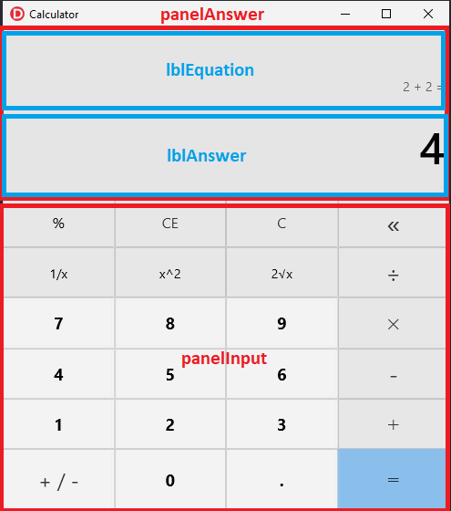

**Created in Delphi using RAD Studio 10.4.1**

# Windows 10 Calculator Clone - Delphi Instructions

## Setup
1. Open RAD Studio.  Click File->New->Multi-Device Application - Delphi and select "Blank Application".
2. Press Cntl+Shift+S to save all files.  Save the .pas file as *"FMXCalculatorLogic"* and the project as *"Calculator"*.
3. Click File->New->Unit - Delphi.  Save this unit as *"Equation.pas"*

## Visual Interface

### Semi-transparent form
1. In the Design window, select *Form1* in the Structure menu, click *Events* in the Object Inspector, and double click next to the ***OnCreate*** action.
2. Paste the following code into the generated TForm1.FormCreate procedure:
```
var     h : HWND;
        aStyle : integer;
        alphaValue : byte;
begin
  h := WindowHandleToPlatform(self.Handle).Wnd;
  AStyle := GetWindowLong(h, GWL_EXSTYLE);
  SetWindowLong(h, GWL_EXSTYLE, AStyle or WS_EX_LAYERED);

  AlphaValue := 240;
  SetLayeredWindowAttributes(h, 0, alphaValue, LWA_ALPHA);
```

### Form Size and Title
1. On the Design tab, select *Form1* in the Structure panel and adjust its properies in the Object Inspect:
    - Caption = Calculator
    - Height = 528
    - Width = 490

### Adding Components
Reference this layout of the calculator components as you build it in RAD Studio.


1. From the **Palette** in the bottom-right corner of the IDE, search "Panel" and add a **TPanel** to *Form 1*.  
2. Select the panel and adjust its properties in the Object Inspector:
    - Align = MostTop
    - Height = 185
    - Name = panelAnswer
    - Width = 490
3. Search the Palette for "Label" and add two **TLabel**s to the *panelAnswer*.  If they are not children of *panelAnswer* in the Structure tree, click and drag them over *panelAnswer* in the Structure tree to make them children.
4. Select the first TLabel and adjust its properties in the Object Inspector:
    - Align = Client
    - Name = lblAnswer
    - Text = ""
    - TextSettings->Font->Size = 48
    - TextSettings->Font->Style = fsBold
    - TextSettings->HorzAlign = Trailing
5. Select the second TLabel and adjust its properties in the Object Inspector:
    - Align = MostTop
    - Height = 73
    - Name = lblEquation
    - Text = ""
    - TextSettings->Font->Size = 14
    - TextSettings->HorzAlign = Trailing
6. For each label, right click it in the Design View, select **Quick Edit...**, click **Layout**, and input ***5*** into both the ***left and right Margin fields**.
7. Select *Form1* in the Structure tree.  Search the Palette and add another **TPanel** as a child of *Form1*.  Adjust its properties in the Object Inspector:
    - Align = Client
    - Name = panelInput
8. Search the Palette and add a **TGridPanelLayout** as a child of *panelInput*.  
    - Set it's **Align** property to **Client** in the Object Inspector.
    - Right click the *ColumnCollection* item in the TGridPanelLayout.  Click ***Add Item***.  Repeat until there are **four** Column items.
    - Right click the *RowCollection* item in the TGridPanelLayout.  Click ***Add Item***.  Repeat until there are **six** Row items.
    - Right click the grid in the Design View and select "View as Text" near the bottom. 
    - Scroll down to *"object GridPanelLayout1: TGridPanelLayout"*.  Highlight the entire GridPanelLayout object and paste in this code to evenly space the grid lines:
    ```
    object GridPanelLayout1: TGridPanelLayout
      Align = Client
      Size.Width = 490.000000000000000000
      Size.Height = 343.000000000000000000
      Size.PlatformDefault = False
      TabOrder = 1
      ColumnCollection = <
        item
          Value = 25.000000000000000000
        end
        item
          Value = 25.000000000000000000
        end
        item
          Value = 25.000000000000000000
        end
        item
          Value = 25.000000000000000000
        end>
      ControlCollection = <>
      RowCollection = <
        item
          Value = 16.666666666666660000
        end
        item
          Value = 16.666666666666660000
        end
        item
          Value = 16.666666666666660000
        end
        item
          Value = 16.666666666666660000
        end
        item
          Value = 16.666666666666660000
        end
        item
          Value = 16.666666666666660000
        end>
    end
    ```
    - Press Alt+F12 to return to the Design View
9. Select *panelInput* in the Structure tree.  Search the Palette and add a **TButton** to *panelInput*.  Copy that button and paste until there are **24 buttons**.  Select the buttons in the Structure tree and drag-and-drop over *GridPanelLayout1* to add them to the grid.        
10. Select *Form1* in the Structure tree.  Search the Palette and add a **TStyleBook** to *Form1*.
11. Set the **StyleBook** property of *Form1* in the Object Inspector to ***StyleBook1***.


After adding all the components, *Form1* should look *roughly* like the Windows 10 calculator without any button labels, styles, or correct sizes.

### Button Configuration
1. Select all the buttons (click the top button in the Structure tree, hold Shift, click the bottom button).  Adjust their properties in the Object Inspector:
    - Align = Client
2. For each button in the grid, change the button's *name* and *caption*.  Make sure to make each button mirror the Windows 10 calculator button location.  Some buttons use unicode symbols for their caption.  From top-left to bottom-right:
    - btnPercent, %
    - btnCE, CE
    - btnClear, C
    - btnBackspace, «
    - btnReciprocal, 1/x
    - btnSquare, x^2
    - btnSquareRoot, 2√x
    - btnDivide, ÷
    - btn7, 7
    - btn8, 8
    - btn9, 9
    - btnMultiply, ✕
    - btn4, 4
    - btn5, 5
    - btn6, 6
    - btnSubtract, -
    - btn1, 1
    - btn2, 2
    - btn3, 3
    - btnAdd, ＋
    - btnChangeSign, + / -
    - btn0, 0
    - btnDecimal, .
    - btnEquals, =
    
    Once complete, the Structure Tree and *Form1* should look like this (without the button colors):
    
    
3. Adjust the Font settings for each button by clicking a button (or range of buttons), scrolling down in the Object Inspector Properties tab, and opening the **TextSettings->Font** submenu.  Change the ***Size*** and ***Style->fsBold*** settings according to the following image. Time can be saved by adjusting groups of buttons at the same time.


### Button Styles
By adjusting button styles, the calculator buttons will more closely resemble the Windows 10 button pallet when unpressed, hovered over, and pressed.
1. Right click any button and select "Edit Default Style".
2. Make **three** copies of the default *Buttonstyle* and name them *WinCalcDigits*, *WinCalcNonDigits*, and *WinCalcEquals*
    - Rename the style using the **StyleName** properties in the Object Inspector.
3. For each style, expand the Style in the Structure tree view, click the ***Background*** item, and double click the *NormalLink* property in the Object Inspector to open the **BitmapLinks Editor**
    - Each style needs a designated image for *NormalLink* (default button appearance), *HotLink* (when the cursor hovers over the button), and *PressedLink* (on cursor click).
    - Click on the Link type you need to change under the *Links* list on the left sidebar, move and resize the rectangle to the appropriate shaded box for that button state.
    - Once finished for every Link state, close the BitmapLinks Editor and save the project.
    
**WinCalcDigits Style:**


**WinCalcNonDigits Style:**


**WinCalcEquals Style:**


4. Apply the button styles to the appropriate button by clicking the button and typing the style name in the *StyleLookup* property in the Object Inspector.
    - = is set to ***WinCalcEquals***
    - 0-9, +/-, and . are set to ***WinCalcDigits***
    - All others are set to ***WinCalcNonDigits***


## Calculator Logic

### Equation Class
Paste the following code into *Equation.pas*.
```
unit Equation;

interface

uses System.SysUtils, System.Types, System.UITypes, System.Classes, System.Variants,
  FMX.Dialogs, StrUtils;


type

  Operations = (Addition, Subtraction, Multiplication, Division, Reciprocal,
                Square, SquareRoot, Percentage, Nothing);

  type ComplexOperand = record
        Value : Real;
        Ops : array of Operations;
  end;

  type Element = record
        Complex : Boolean;
        Operand : ComplexOperand;
        Operation : Operations;

  end;


  TEquation = class(TObject)

    private
       equation : array of Element;
       lastOperandComplex : Boolean;

       function solveComplexOperand (op : ComplexOperand; index : Integer; num : Real) : Real;
       function printElement ( elem : Element; index : integer ) : String;

    public
        constructor Create();
        procedure clear();
        procedure addElement(num : Real; op : Operations);
        procedure addComplexElement(num : Real; op : Operations);
        procedure repeatLast(currentOperand : Real);
        function solveEquation (lastOperand : Real; finalSolution : Boolean) : Real;
        function printEquation () : String;
        function getLength () : Integer;
        function getValueLast() : Real;
  end;

implementation


  constructor TEquation.Create();
  begin
    SetLength(equation, 0);
    lastOperandComplex := false;
  end;


  {*
    Erase the current equation without memory leaks
  *}
  procedure TEquation.clear();
  begin
        for var i := Low(equation) to High(equation) do
                SetLength(equation[i].Operand.Ops, 0);
        SetLength(equation, 0);
        lastOperandComplex := false;
  end;


  {*
    Add a new element.  Special case: last operand was complex so the operation
    is all the must be added.
  *}
  procedure TEquation.addElement(num : Real; op : Operations);
  begin
        // Add operation to the last element - known to be complex
        if lastOperandComplex then
        begin
          equation[Length(equation)-1].Operation := op;
        end

        // New element entirely
        else
        begin
          var newElem : Element;
          newElem.Complex := false;
          newElem.Operand.Value := num;
          newElem.Operation := op;

          SetLength(equation, Length(equation) + 1);
          equation[Length(equation) - 1] := newElem;
        end;

        lastOperandComplex := false;
  end;


  {*
    Chain complex operators (reciprocal, sq, sqrt) onto the last operand
  *}
  procedure TEquation.addComplexElement(num : Real; op : Operations);
  var
        eqLen : Integer;
  begin
        // Second complex operator in a row - add to last
        if lastOperandComplex then
        begin
          Insert(op, equation[High(equation)].Operand.Ops, 0);
          equation[High(equation)].Operation := Operations.Nothing;
        end

        // Completely new element
        else
        begin
          var newElem : Element;
          var newOperand : ComplexOperand;
          newElem.Complex := true;
          newOperand.Value := num;
          SetLength(newOperand.Ops, 1);
          newOperand.Ops[0] := op;
          newElem.Operand := newOperand;
          newElem.Operation := Operations.Nothing;

          eqLen := Length(equation);
          SetLength(equation, eqLen + 1);
          equation[eqLen] := newElem;
        end;

        lastOperandComplex := true;
  end;


  procedure TEquation.repeatLast(currentOperand : Real);
  begin

    var repeatElement := equation[High(equation)];
    repeatElement.Operand.Value := currentOperand;
    SetLength(repeatElement.Operand.Ops, 0);
    SetLength(equation, 1);
    equation[0] := repeatElement;

  end;


  function TEquation.getValueLast() : Real;
  begin
    result := 0.0;

    if Length(equation) > 0 then
      result := solveComplexOperand(equation[High(equation)].Operand, 0, 0);
  end;


  function TEquation.solveEquation (lastOperand : Real; finalSolution : Boolean) : Real;
  begin

    var nextOp := Operations.Nothing;
    var eqResult := 0.0;
    var elemOperand : Real;

    for var i := 0 to High(equation) do
    begin

      if equation[i].Complex then
        elemOperand := solveComplexOperand(equation[i].Operand, 0, eqResult)
      else
        elemOperand := equation[i].Operand.Value;

      if i > 0 then
      begin
        case nextOp of

         Addition: eqResult := eqResult + elemOperand;
         Subtraction: eqResult := eqResult - elemOperand;
         Multiplication: eqResult := eqResult * elemOperand;
         Division:
         begin
            if equation[i].Operand.Value <> 0 then
               eqResult := eqResult / elemOperand
            else
               raise Exception.Create('Cannot divide by zero');
         end;
        end;
      end
      else
        eqResult := elemOperand;

      nextOp := equation[i].Operation;
    end;

    if finalSolution then
    begin
      case nextOp of

       Addition: eqResult := eqResult + lastOperand;
       Subtraction: eqResult := eqResult - lastOperand;
       Multiplication: eqResult := eqResult * lastOperand;
       Division:
       begin
          if lastOperand <> 0 then
             eqResult := eqResult / lastOperand
          else
             raise Exception.Create('Cannot divide by zero');
       end;

       Nothing: eqResult := lastOperand;
      end;
    end;

    result := eqResult;

  end;

  {*
     Poor-man's recursion with index
  *}
  function TEquation.solveComplexOperand (op : ComplexOperand; index : Integer; num : Real) : Real;
  begin

    result := op.Value;

    if index < Length(op.Ops) then
    begin
      case op.Ops[index] of
        Reciprocal : result := 1 / solveComplexOperand (op, index + 1, num);
        Square : result := Sqr(solveComplexOperand (op, index + 1, num));
        SquareRoot : result := Sqrt(solveComplexOperand (op, index + 1, num));
        Percentage : result := num * (op.Value / 100);
      end;
    end;
  end;


  function TEquation.printEquation () : String;
  begin
   var collector := '';

   for var i := Low(equation) to High(equation) do
     collector := collector + ' ' + printElement(equation[i], 0);

    result := collector;
  end;

  {*
    Poor-man's recursion using an index because I can't figure out how to copy
    arrays passed as parameters.
  *}
  function TEquation.printElement ( elem : Element; index : integer ) : String;
  begin

    result := '';

    // Simple operand
    if not elem.Complex then
    begin
      result := FloatToStr(elem.Operand.Value);
      case elem.Operation of
       Addition :  result := result + ' +';
       Subtraction :  result := result + ' -';
       Multiplication :  result := result + ' ×';
       Division :  result := result + ' ÷';
      end;
    end

    else
    begin
      // Base case for complex operand
      if Length(elem.Operand.Ops) = index then
      begin
          result := FloatToStr(elem.Operand.Value);
      end

      // Recurse over complex operands
      else
      begin
        case elem.Operand.Ops[index] of
         Reciprocal : result := '1/( ' + printElement(elem, index + 1) + ')';
         Square :  result := 'sqr( ' + printElement(elem, index + 1) + ')';
         SquareRoot : result := '√( ' + printElement(elem, index + 1) + ')';
         Percentage : result := printElement(elem, index + 1) + '%';
        end;

      end;
    end;
  end;


function TEquation.getLength () : Integer;
begin
  result := Length(equation);
end;

end.
```

### FMXCalculatorLogic Private Members
Paste the following code into the *private* section of the *FMXCalculatorLogic* type description:

```
{ Private declarations }
    calcState : State;
    equation : TEquation;
    lastOperand : Real;


    procedure updateEquationLabel();
    procedure addElementToEquation (num : Real; op : Operations );
    procedure updateOperator(op : Operations);
    procedure repeatLastElement ();
```
Paste the following code into the *FMXCalculatorLogic* file below the *implementation* keyword.

```
procedure TForm1.updateEquationLabel();
begin
  lblEquation.Text := equation.printEquation();
end;

{*
  Add operand/operator according to calculator state.
*}
procedure TForm1.updateOperator(op : Operations);
begin

  // Special case - use result of last calculation as first operand
  if calcState = State.Solved then
  begin
    equation.clear();
    calcState := State.InputFirstDigit;
  end;


  if (calcState <> State.Error) and ((calcState <> State.InputFirstDigit)) then
  begin

    var partialSolution : String;
    partialSolution := '0';

    addElementToEquation(StrToFloat(lblAnswer.Text), op);

    // Calculate partial solution if more than one operand
    try
      partialSolution := FloatToStr(equation.solveEquation(0, false));
    except
      partialSolution := 'Cannot divide by zero';
      calcState := State.Error;
    end;


    updateEquationLabel();
    lblAnswer.Text := partialSolution;

    if calcState <> State.Error then
      calcState := State.InputFirstDigit;
  end

  // Special case for complex operands
  else if (calcState = State.InputFirstDigit) and
     ((op = Operations.Reciprocal) or (op = Operations.Square) or
      (op = Operations.SquareRoot) or (op = Operations.Percentage))  then
  begin

    var partialSolution : String;
    partialSolution := '0';

    addElementToEquation(StrToFloat(lblAnswer.Text), op);

    // Calculate partial solution if more than one operand
    try
      partialSolution := FloatToStr(equation.solveEquation(0, false));
    except
      partialSolution := 'Cannot divide by zero';
      calcState := State.Error;
    end;


    updateEquationLabel();
    lblAnswer.Text := partialSolution;

    if calcState <> State.Error then
      calcState := State.InputFirstDigit;
  end;
end;


procedure TForm1.addElementToEquation (num : Real; op : Operations );
begin
  //ShowMessage ('Adding operator');
  if (op = Operations.Addition) or (op = Operations.Subtraction) or
        (op = Operations.Multiplication) or (op = Operations.Division) then
    equation.addElement(num, op)
  else
    equation.addComplexElement(num, op);
end;

procedure TForm1.repeatLastElement ();
begin
    //ShowMessage ('repeatLastElement lblAnswer: ' + lblAnswer.Text);
    if equation.getLength() > 0 then
    begin
      equation.repeatLast(StrtoFloat(lblAnswer.Text));
      lblAnswer.Text := FloatToStr(lastOperand);
      updateEquationLabel();
      calcState := State.InputFollowingDigits;
    end
    else
      calcState := Solved;
end;
```

### FMXCalculatorLogic Setup
1. Make sure the *uses* statements should include the following units:
```
System.SysUtils, System.Types, System.UITypes, System.Classes, System.Variants,
  FMX.Types, FMX.Controls, FMX.Forms, FMX.Graphics, FMX.Dialogs, FMX.StdCtrls,
  FMX.Layouts, FMX.Controls.Presentation, StrUtils, FMX.Ani, FMX.Effects, fmx.platform.win,
  winapi.windows, FMX.Objects, Equation;
```
2. Add the calcluator *State* enum to the *type* clause above the TForm1 class declaration.
`State = (InputFirstDigit, InputFollowingDigits, Solved, Error);`
3. On the Design tab, select *Form1* from the Structure menu, click the Events tab in the Objet Inspector, and double-click the ***onShow*** event option.  Paste the following code into the generated procedure:
```
  equation := TEquation.Create();
  resetCalculator(Sender);
```

### Clear/Back Buttons
1. Double click the ***CE*** button.  Paste the following code into the generated procedure:
```
  if calcState = State.Solved then
    resetCalculator(Sender)
  else
  begin
    lblAnswer.Text := '0';
    calcState := State.InputFirstDigit;
  end;
```
2. Double click the ***<<*** button.  Paste the following code into the generated procedure:
```
if calcState = State.Solved then
  begin
    lblEquation.Text := '';
    equation.clear();
  end
  else if calcState <> State.Error then
  begin
    if lblAnswer.Text.Length = 1 then
      lblAnswer.Text := '0'
    else
      lblAnswer.Text := lblAnswer.Text.Substring(0, lblAnswer.Text.Length - 1);
  end;
```
3. Add this procedure header to the **type** section of the ***FMXCalculatorLogic.pas*** file above the public/private declarations
`procedure resetCalculator(Sender: TObject);`
4. Paste the ***resetCalculator*** implementation below the **implementation** keyword.
```
procedure TForm1.resetCalculator(Sender: TObject);
begin
  lblAnswer.Text := '0';
  lblEquation.Text := '';
  lastOperand := 0;
  calcState := State.InputFirstDigit;
  equation.clear();
end;
```
5. Click the **C** button on *Form1* in the Design View, navigate to the Events tab of the Object Inspector, select the dropdown arrow next to the *OnClick* event and select ***resetCalculator***.


### Digit Buttons
1. Paste this procedure into the **type** declaration near the top of ***FMXCalculatorLogic.pas***.  It cannot be in the *public* or *private* declaration sections.
`procedure digitClick(Sender: TObject);`
2. Paste this procedure implementation below the **implemenation** keyword.
```
{*
   Accumulate digit input in the main label field.  Specific logic to replace
   '0' with a digit, to handle a decimal place correctly in the event of '0.x',
   and to continue calculating with the result from a previous calculation.
*}
procedure TForm1.digitClick(Sender: TObject);
var
  operand : Real;
begin
  if calcState = State.Solved then
    resetCalculator(Sender);


  if calcState = State.InputFollowingDigits then
  begin
    operand := StrtoFloat(lblAnswer.Text);

    if lblAnswer.Text.Contains('.') then
      lblAnswer.Text := lblAnswer.Text + (Sender as TButton).Text
    else if operand = 0 then
      lblAnswer.Text := (Sender as TButton).Text
    else
      lblAnswer.Text := lblAnswer.Text + (Sender as TButton).Text;
  end
  else if calcState = State.InputFirstDigit then
  begin
    lblAnswer.Text := (Sender as TButton).Text;
    calcState := State.InputFollowingDigits;
  end;
end;
```
3. Select the **0-9** buttons in the Structure tree view or on *Form1* in the Design View.  Navigate to the Events tab of the Object Inspector.  Select the dropdown arrow next to the *OnClick* event and select ***digitClick***.


### Decimal Button
Double click the decimal button in the Design View and paste this code into the generated procedure:
```
  if calcState <> State.Error then
  begin

    if calcState = State.Solved then
      resetCalculator(Sender);

    if calcState = State.InputFirstDigit then
    begin
      lblAnswer.Text := '0.';
      calcState := State.InputFollowingDigits;
    end;

    if (RightStr(lblAnswer.Text, 1) <> '.') and
    (not lblAnswer.Text.Contains('.')) then
      lblAnswer.Text := lblAnswer.Text + (Sender as TButton).Text;
  end;
```

### ChangeSign Button
Double click the +/- button in the Design View and paste this code into the generated procedure:
```
  if calcState <> State.Error then
  begin
    var operand := -(StrtoFloat(lblAnswer.Text));

    if operand <> 0 then
      lblAnswer.Text := FormatFloat('0.#########', operand);
  end;
```

### Operator Buttons 
For each operator button on *Form1*, double click and paste in the following code:
- "+" `updateOperator(Operations.Addition);`
- "-" `updateOperator(Operations.Subtraction);`
- "✕" `updateOperator(Operations.Multiplication);`
- "÷" `updateOperator(Operations.Division);`
- "%" `updateOperator(Operations.Percentage);`
- "1/x" `updateOperator(Operations.Reciprocal);`
- "x^2" `updateOperator(Operations.Square);`
- "2√x" `updateOperator(Operations.SquareRoot);`

### Equals Button
Double click the = button in the Design View and paste this code into the generated procedure:
```
 var
  eqResult : Real;
begin

  if calcState = State.Solved then
        repeatLastElement();

  if calcState = State.InputFirstDigit then
  begin
    if (equation.getLength() = 0) then
    begin
      lblEquation.Text := lblAnswer.Text + ' =';
      calcState := State.Solved;
    end
    else
    begin
      lastOperand := StrtoFloat(lblAnswer.Text);
      eqResult := equation.solveEquation(0, false);
      lblEquation.Text := FloatToStr(eqResult) + ' =';
      lblAnswer.Text := FloatToStr(eqResult);
      calcState := State.Solved;
    end;
  end

  else if (calcState <> State.Error) and (calcState <> Solved) then
  begin
    lastOperand := StrtoFloat(lblAnswer.Text);

    try
      eqResult := equation.solveEquation (lastOperand, true);
    except
      lblAnswer.Text := 'Cannot divide by zero';
      calcState := State.Error;
    end;


    if (calcState <> State.Error) then
    begin
      lblAnswer.Text := FloatToStr(eqResult);
      lblEquation.Text := lblEquation.Text + ' ' + FloattoStr(lastOperand) + ' =';
      calcState := State.Solved;
    end;
  end;
end;
```


## Testing

### Simple Operations
- Test addition, subtraction, etc. Make sure the full equation is displayed above the correct answer when the "=" button is pressed.
- Test the clear, clear equation, and back buttons.
- Test the numpad keybindings.

### Complex Operations
- Test the square, square root, reciprocal, and percentage operators.  

### Chained Operations 
- Build a long equation without pressing the "=" button.  Does the correct answer calculate every time you click a new operator? 
- Enter an equation and press the "=" button.  Repeatedly press "=" and see if the equation repeats the last operation.
